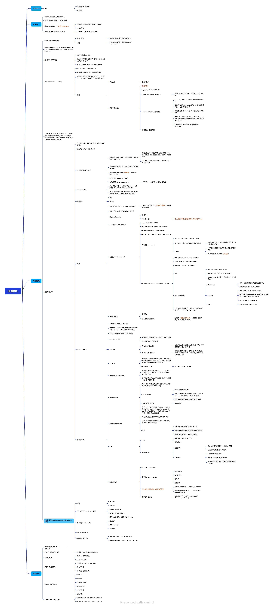

## 目录结构

- `source_code/`：示例源码
  - 重要的代码示例：
    1. [`source_code/ch04/train_neuralnet.py`](source_code/ch04/train_neuralnet.py) 神经网络的学习的实现示例（随机梯度下降法）
    2. [`source_code/ch05/train_neuralnet.py`](source_code/ch05/train_neuralnet.py)（随机梯度下降法）(使用误差反向传播法计算梯度)
- `learning_notes/`：学习笔记
  - [每章摘要总结](learning_notes/每章摘要总结.md)：每章的摘要总结
  - [扩展知识答疑](learning_notes/扩展知识答疑.md)：学习过程中的扩展知识和答疑
  - ：整体学习笔记思维导图
- `pdf/`：书籍资源
